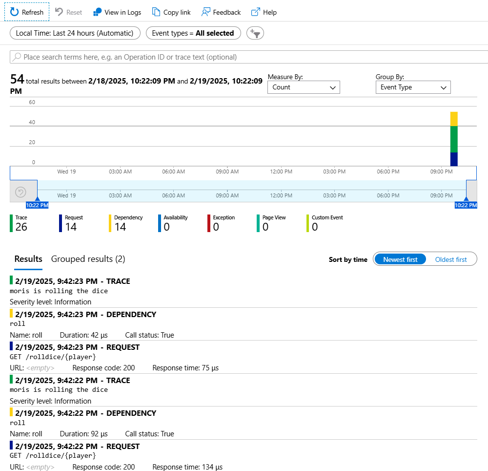

# Collecting OpenTelemetry Data in Azure Container Apps and Sending to Application Insights

[日本語のREADME](./README_ja.md)

This is a sample for sending telemetry information from a Go web server while using the OpenTelemetry data agent in an Azure Container Apps environment.

As of now (February 2025), Application Insights only supports logs and traces.

- :o: Logs
- :o: Traces
- :x: Metrics

## Azure Configuration

The resources to be created are as follows:

- User-assigned Managed Identity
- Azure Container Registry
- **Application Insights**
- Azure Container App Environment **with OpenTelemetry**
- Azure Container Apps

The user-assigned managed identity is necessary for Azure Container Apps to access the Azure Container Registry, and the ACR Pull role is assigned.

Enable the OpenTelemetry extension for the Azure Container App Environment. The destination is Application Insights.

## Source Configuration

For the initialization of OpenTelemetry, refer to the following document:

[Getting Started | OpenTelemetry](https://opentelemetry.io/docs/languages/go/getting-started/)

When OpenTelemetry is configured, the following environment variables are automatically set. The Go OpenTelemetry SDK will automatically configure itself if these environment variables are set.

- OTEL_EXPORTER_OTLP_ENDPOINT
- OTEL_EXPORTER_OTLP_PROTOCOL
- OTEL_EXPORTER_OTLP_TRACES_ENDPOINT
- OTEL_EXPORTER_OTLP_METRICS_ENDPOINT
- OTEL_EXPORTER_OTLP_LOGS_ENDPOINT

If not configured, logs are modified to be output to stderr. This is for local verification.

The web server also uses a sample. When you access `rolldice/{player}`, it rolls a dice and returns the result.

## Deployment Steps

First, appropriately modify the `SUFFIX` in the `Makefile` to ensure that resource names do not overlap globally. Then proceed with the following steps:

```sh
make rg    # Create resource group
make env   # Create Container Apps environment and ACR

export ACR_NAME=<acr-name>  # Set the name of the ACR

make acr-login              # Log in to ACR
make build-image            # Build & push the image
make deploy                 # Deploy to Container Apps

```

### Application Insights

You can confirm the following content



### Links

- [Collect and read OpenTelemetry data in Azure Container Apps (preview) | Microsoft Learn](https://learn.microsoft.com/en-us/azure/container-apps/opentelemetry-agents?tabs=bicep%2Carm-example)